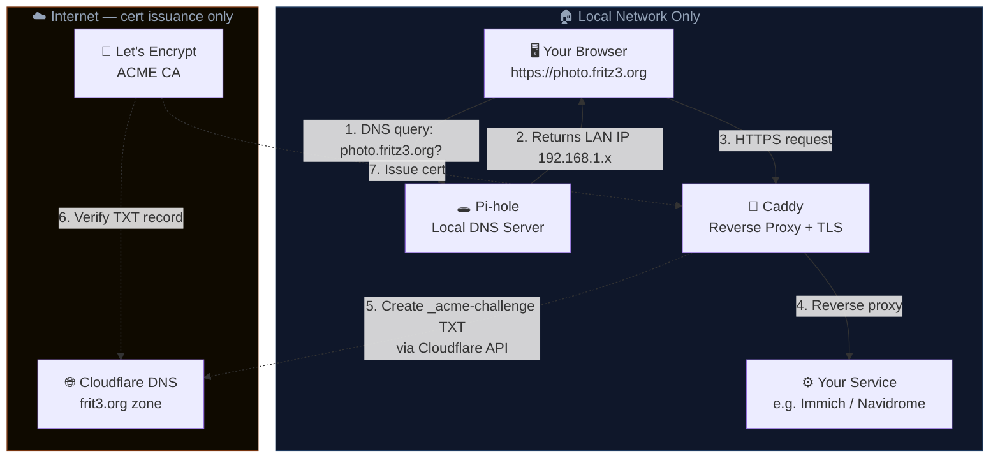

# Home Server

Self-hosted services running on a local Ubuntu server — Caddy handles TLS and reverse proxying, Pi-hole handles local DNS, and Cloudflare handles DNS-01 certificate issuance without exposing anything to the internet.

---

## Services

| Service | Purpose | Port | Compose |
|---------|---------|------|---------|
| [Caddy](https://caddyserver.com) | Reverse proxy + automatic TLS | 80, 443 | `caddy/` |
| [Immich](https://immich.app) | Photo & video library | 2283 | `immich/` |
| [Navidrome](https://navidrome.org) | Music streaming | 4533 | `navidrome/` |
| [MediaMTX](https://github.com/bluenviron/mediamtx) | RTSP/media relay | host network | `mediamtx/` |
| [AFFiNE](https://affine.pro) | Docs, whiteboards & knowledge base | 3030 | `affine/` |

Each service lives in its own subdirectory with its own `docker-compose.yml`.

---

## How It Works



**Solid lines** are the normal request path — entirely LAN-local. Pi-hole resolves the domain to the server's local IP, Caddy terminates TLS and proxies to the right container.

**Dotted lines** only happen during cert issuance and renewal. Caddy calls the Cloudflare API to create a `_acme-challenge` TXT record, Let's Encrypt verifies it, and a certificate comes back. No inbound ports need to be open.

### The Pi-hole DNS gotcha

Caddy's Docker container inherits DNS from the host, which is Pi-hole. Pi-hole has a local override for the domain, so when Caddy tries to look up Cloudflare's nameservers to place the TXT record, Pi-hole intercepts it and returns `SERVFAIL`.

**Fix:** add `dns` to Caddy's compose service so it bypasses Pi-hole for its own lookups:

```yaml
services:
  caddy:
    dns:
      - 1.1.1.1
      - 8.8.8.8
```

Your other devices are unaffected — only the Caddy container uses these resolvers.

---

## Setup

### Prerequisites

- Docker + Docker Compose
- A Cloudflare-managed domain
- Pi-hole (or any local DNS) with an override pointing your subdomains to the server's LAN IP

### 1. Create the external Caddy data volume

Caddy stores certificates in a named volume marked `external: true`. Create it once before first run:

```bash
docker volume create caddy_data
```

### 2. Set the Cloudflare API token

Create a `.env` file in `caddy/`:

```bash
# caddy/.env
CLOUDFLARE_API_TOKEN=your_token_here
```

The token needs **Zone / DNS / Edit** permissions for your domain. A scoped token (one zone only) is recommended over a Global API Key.

### 3. Configure the Caddyfile

Copy the example and edit it with your subdomains and backend addresses:

```bash
cp caddy/Caddyfile.example caddy/Caddyfile
```

Minimal example for two services:

```
photo.fritz3.org {
    reverse_proxy immich_server:2283
    tls {
        dns cloudflare {env.CLOUDFLARE_API_TOKEN}
    }
}

music.fritz3.org {
    reverse_proxy navidrome:4533
    tls {
        dns cloudflare {env.CLOUDFLARE_API_TOKEN}
    }
}
```

### 4. Add the Pi-hole local DNS override

In Pi-hole's admin UI, add a **Local DNS Record** pointing your domain (or a wildcard CNAME) to the server's LAN IP — e.g. `192.168.1.x`. This is what makes HTTPS work without any traffic leaving the network.

### 5. Start services

Each service is started independently:

```bash
docker compose -f caddy/docker-compose.yml up -d
docker compose -f immich/docker-compose.yml up -d
docker compose -f navidrome/docker-compose.yml up -d
docker compose -f mediamtx/docker-compose.yml up -d
docker compose -f affine/docker-compose.yml up -d
```

---

## AFFiNE Setup

Self-hosted knowledge base powered by [AFFiNE](https://affine.pro) — an open-source alternative to Notion with docs, whiteboards, and databases. Supports real-time collaboration via WebSocket and has desktop and mobile apps.

### 1. Create environment file

```bash
cp affine/.env.example affine/.env
```

Edit `affine/.env`:

- Set `AFFINE_SERVER_HOST` to your domain (e.g. `notes.yourdomain.com`)
- Set a strong `DB_PASSWORD`

### 2. Create data directories

```bash
mkdir -p affine/postgres affine/storage affine/config
```

### 3. Start services

```bash
docker compose -f affine/docker-compose.yml up -d
```

This starts four containers: AFFiNE (app), a one-shot migration job, PostgreSQL (with pgvector), and Redis. The migration container runs database migrations automatically and exits before the main app starts.

### 4. Add Caddyfile entry

Add the `notes.mydomain.com` block from `Caddyfile.example` to your Caddyfile, updating the domain. Caddy natively supports WebSocket proxying, which AFFiNE's real-time editor requires.

### 5. Add Pi-hole DNS override

Add a local DNS record for `notes.yourdomain.com` pointing to your server's LAN IP.

### 6. Complete web setup

Navigate to `https://notes.yourdomain.com` in your browser. Create your admin account — the first registered user becomes the workspace owner.

After logging in, go to **Admin -> Settings -> Server** and set the **External URL** to `https://notes.yourdomain.com`. This ensures invitation links and shared doc URLs are generated correctly.

### Desktop & mobile apps

AFFiNE has desktop apps (macOS, Windows, Linux) and mobile apps (iOS, Android). After setup, you can connect them to your self-hosted instance by adding your server URL in the app settings.

### Upgrade

```bash
docker compose -f affine/docker-compose.yml pull
docker compose -f affine/docker-compose.yml up -d
```

---

<details>
<summary><strong>Recovery Runbook</strong> — post-incident notes after a power outage</summary>

<br>

## Environment

Server running:

* Ubuntu
* Docker services (Navidrome, Immich, etc.)
* VirtualBox VM running Home Assistant
* Filesystem: ext4

Issue occurred after **power outage**.

---

## Incident: Kernel Panic on Boot

Error message:

```
Kernel panic - not syncing
VFS: Unable to mount root fs on unknown-block(0,0)
```

### Root Cause

Power outage interrupted disk writes causing **filesystem journal corruption**.

The kernel could not mount the root filesystem.

---

## Primary Fix (Successful)

### 1. Boot into GRUB Recovery Mode

During boot:

```
Shift (BIOS)
or
Esc (UEFI)
```

Select:

```
Advanced options for Ubuntu
```

Then:

```
Recovery Mode
```

---

### 2. Run Filesystem Check

From recovery menu:

```
fsck — Check all file systems
```

This runs `fsck`, which repairs:

* inode inconsistencies
* journal corruption
* block allocation errors

After completion:

```
resume — Resume normal boot
```

System successfully booted.

---

## Post-Recovery Steps

### Force Full Filesystem Scan

```bash
sudo touch /forcefsck
sudo reboot
```

Ensures a complete scan on next boot.

---

### Verify Disk Health

Install SMART tools:

```bash
sudo apt install smartmontools
```

Check disk:

```bash
sudo smartctl -a /dev/sda
# or
sudo smartctl -a /dev/nvme0n1
```

Important fields to check (all should ideally be `0`):

```
Reallocated_Sector_Ct
Current_Pending_Sector
Offline_Uncorrectable
```

---

## Secondary Issue: Virtual Machine Failure

Error from VirtualBox:

```
VERR_SVM_IN_USE
VirtualBox can't enable the AMD-V extension
Please disable the KVM kernel extension
```

### Cause

KVM kernel modules loaded and reserved hardware virtualization — VirtualBox and KVM cannot coexist.

### Fix

Unload KVM modules:

```bash
sudo modprobe -r kvm_amd
sudo modprobe -r kvm
```

### Permanent Fix (Optional)

Blacklist KVM modules so they never load:

```bash
sudo nano /etc/modprobe.d/blacklist-kvm.conf
```

Add:

```
blacklist kvm
blacklist kvm_amd
```

Reboot.

> **Note:** If you eventually migrate from VirtualBox to QEMU/libvirt (recommended below), remove this blacklist file — libvirt relies on KVM.

---

## Alternative Recovery Methods (If Recovery Mode Fails)

### Method 1 — Live USB Repair

Boot from an Ubuntu Live USB, then:

```bash
lsblk
```

Identify your root partition (commonly `/dev/sda2`), then repair:

```bash
sudo fsck -f /dev/sda2
```

Reboot.

### Method 2 — Rebuild Initramfs

From a recovery shell:

```bash
mount -o remount,rw /
update-initramfs -u
update-grub
reboot
```

---

## Future-Proofing: Prevention Strategy

Tackle these in order — each one builds on the last:

1. **Buy a UPS with USB** — do this first; everything else builds on it
2. **Fix `GRUB_RECORDFAIL_TIMEOUT`** — 10-minute fix, prevents getting stuck at boot screen
3. **Set up NUT with proper Docker shutdown ordering**
4. **Configure restic + Healthchecks.io** for automated verified backups
5. **Add `pg_dump` to backup pipeline** for Immich/Postgres
6. **Migrate VirtualBox → QEMU/libvirt** for Home Assistant
7. **Consider Btrfs** if ever doing a fresh OS install or adding a new data drive

### 1. Install a UPS — Most Important

A power outage is the root cause of this entire class of problem. A single UPS purchase prevents it.

**Recommended brands:** APC, CyberPower

**Critical:** Buy one with a **USB connection**, not just a power strip with a battery. The USB port is what allows the server to detect power loss and shut down gracefully.

Benefits:
* Battery backup during outage
* Graceful shutdown before battery dies
* Surge protection

### 2. Fix GRUB_RECORDFAIL_TIMEOUT

After any failed or interrupted boot, GRUB's `RECORDFAIL_TIMEOUT` defaults to `-1`, meaning it will **wait forever** at the boot menu.

Edit `/etc/default/grub`:

```bash
sudo nano /etc/default/grub
```

Set:

```
GRUB_TIMEOUT=5
GRUB_RECORDFAIL_TIMEOUT=5
```

Apply:

```bash
sudo update-grub
```

### 3. NUT for Automatic Shutdown on Power Loss

NUT (Network UPS Tools) lets your server detect when the UPS switches to battery and initiate a safe, ordered shutdown before power runs out.

```bash
sudo apt install nut
```

Edit `/etc/nut/nut.conf`:

```
MODE=standalone
```

Stop Docker containers **before** the OS shuts down to prevent database corruption:

```bash
# /etc/nut/upsmon.conf — SHUTDOWNCMD
SHUTDOWNCMD "docker stop $(docker ps -q) && sleep 5 && /sbin/shutdown -h now"
```

### 4. Automated Backups with Restic + Healthchecks.io

**Restic** deduplicates, compresses, encrypts, and has a built-in integrity check.

```bash
sudo apt install restic
restic init --repo /srv/backups/restic-repo
```

Example backup script:

```bash
#!/bin/bash
RESTIC_REPOSITORY="/srv/backups/restic-repo"
RESTIC_PASSWORD_FILE="/etc/restic-password"

restic -r $RESTIC_REPOSITORY backup \
  /srv/music \
  /srv/docker \
  /srv/postgres \
  --exclude /srv/docker/tmp

restic -r $RESTIC_REPOSITORY forget \
  --keep-daily 7 \
  --keep-weekly 4 \
  --keep-monthly 6 \
  --prune

# Ping Healthchecks.io — alerts if the job stops running
curl -fsS --retry 3 https://hc-ping.com/YOUR-UUID-HERE > /dev/null
```

Schedule with cron:

```
0 3 * * * /usr/local/bin/backup.sh >> /var/log/restic-backup.log 2>&1
```

### 5. Database Backup for Immich/Postgres

A filesystem snapshot is **not sufficient** for a running Postgres instance. Always dump before the nightly restic backup:

```bash
docker exec immich_postgres pg_dumpall -U postgres \
  > /srv/backups/immich_$(date +%F).sql

# Rotate — keep last 7 daily dumps
find /srv/backups/ -name "immich_*.sql" -mtime +7 -delete
```

### 6. Migrate VirtualBox → QEMU/libvirt for Home Assistant

VirtualBox and KVM cannot coexist. QEMU/KVM with libvirt is the better long-term fit on Linux.

```bash
sudo apt install qemu-kvm libvirt-daemon-system virt-manager
sudo usermod -aG libvirt $USER
```

Remove the KVM blacklist if you added one:

```bash
sudo rm /etc/modprobe.d/blacklist-kvm.conf
sudo reboot
```

The Home Assistant project provides a `.qcow2` image for KVM/QEMU directly at https://www.home-assistant.io/installation/linux.

### 7. Filesystem (Long-Term)

| Filesystem | Benefit | Caveat |
|------------|---------|--------|
| ZFS | Checksums, self-healing, excellent for RAID | Memory-hungry — wants 8GB+ RAM |
| Btrfs | Snapshots, corruption detection, in-kernel | Less mature than ZFS for RAID |
| ext4 (current) | Stable, simple | No checksums, no snapshots |

For a typical homelab media server, **Btrfs is the more practical choice** — in-kernel, no extra RAM, handles snapshots well. Worth considering on the next fresh OS install or new data drive.

---

## Recommended Directory Layout

```
/srv
 ├── docker/         # Docker bind mount data
 ├── postgres/       # Postgres data directory
 ├── music/          # Navidrome music library
 ├── immich/         # Immich media uploads
 └── backups/        # Restic repo + pg_dumps
```

---

## Summary

| # | Action | Impact |
|---|--------|--------|
| 1 | UPS with USB | Prevents the outage from reaching the server |
| 2 | Fix GRUB_RECORDFAIL_TIMEOUT | Prevents stuck boot screen |
| 3 | NUT + Docker shutdown ordering | Graceful shutdown before battery dies |
| 4 | Restic + Healthchecks.io | Verified, monitored backups |
| 5 | pg_dump before backup | Safe Postgres snapshots |
| 6 | Migrate to QEMU/libvirt | Eliminate AMD-V conflicts permanently |
| 7 | Btrfs (next fresh install) | Checksums + snapshots at the filesystem level |

</details>
